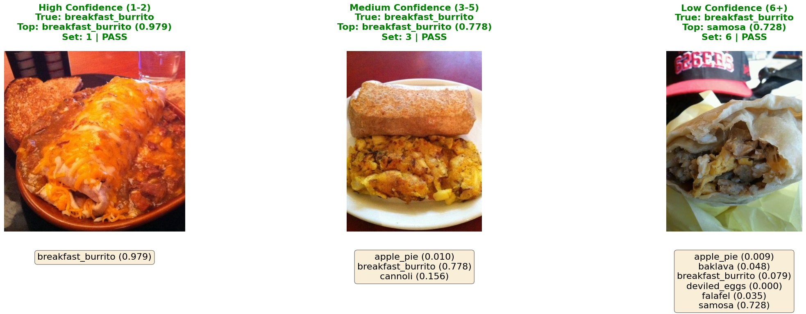

# Food101 Conformal Prediction on Databricks

A production-ready implementation of conformal prediction for food image classification using Vision Transformer (ViT) on the Food101 dataset.

**Adaptive Prediction Sets:**
Unlike traditional classifiers that output a single prediction, this implementation of a conformal classification model generates prediction sets that adapt based on uncertainty. All predictions maintain a 90% coverage guarantee, while offering a model-agnostic, distribution-free way to communicate uncertainty to stakeholders.

This is valuable in high-stakes applications where knowing when the model is uncertain matters as much as the prediction itself.



*Three examples showing conformal prediction with 90% coverage guarantee:*
- **Left (High Confidence):** Clean breakfast burrito image produces a single-class prediction set
- **Center (Medium Confidence):** More ambiguous image yields 3 possible classes
- **Right (Low Confidence):** Difficult image requires 6 classes to maintain 90% coverage

---

## Key Benefits

- ✅ **Statistical guarantees** - 90% coverage guarantee maintained across all predictions
- ✅ **Uncertainty quantification** - Know when the model is uncertain
- ✅ **Distribution-free** - No assumptions about data distribution
- ✅ **Model-agnostic** - Works with any classifier
- ✅ **Production-ready** - Deployed on Databricks Model Serving
- ✅ **Reproducible** - Pinned dependencies and MLflow tracking

---

## Demo

See the conformal prediction model in action! This [Databricks App](https://github.com/jonathan-whiteley/food101-cv-app) calls the Model Serving endpoint created in 02-Conformal-Model.ipynb to provide real-time classification of food images with uncertainty quantification.


*The app demonstrates how prediction sets adapt in real-time: confident predictions return 1-2 classes, while uncertain images return larger sets to maintain the 90% coverage guarantee.*

---

## ML Stack

This project leverages the complete Databricks Data Intelligence Platform:

- **Data Management**: Hugging Face Food101 dataset loaded into Unity Catalog as Delta tables
- **Model Training**: Hugging Face Vision Transformer (ViT) fine-tuned on Databricks Serverless GPUs
- **Experiment Tracking**: MLflow for model versioning, metrics tracking, and reproducibility
- **Model Registry**: Unity Catalog for centralized model governance and lineage
- **Conformal Prediction**: RAPS (Regularized Adaptive Prediction Sets) implementation with PyFunc custom models
- **Deployment**: Databricks Model Serving with REST API endpoints for real-time inference
- **Applications**: Databricks Apps for interactive web interfaces with uncertainty visualization

---

## Understanding the Results

Prediction set size adapts based on model confidence. RAPS (Regularized Adaptive Prediction Sets) applies a penalty to discourage overly large sets, keeping predictions informative:

| Set Size | Example | What This Means |
|----------|---------|-----------------|
| **1-2 classes** (High confidence) | breakfast_burrito | Model has strong evidence for one class |
| **3-4 classes** (Medium confidence) | {breakfast_burrito, tacos, huevos_rancheros} | Multiple classes are plausible — the model is hedging between similar options |
| **5-6 classes** (Low confidence) | {breakfast_burrito, tacos, falafel, takoyaki, huevos_rancheros, samosa} | Model cannot distinguish between many options — high uncertainty |

### The 90% Coverage Guarantee

**Across all predictions, at least 90% of the prediction sets contain the true label.** This guarantee is calibrated using held-out data and holds regardless of data distribution or model architecture.

This is fundamentally different from traditional confidence scores, which are often miscalibrated and provide no formal guarantees.

---

## Quick Start

### Prerequisites

```bash
# Databricks Runtime 13.0+ with ML support
# Python 3.10+
# GPU recommended for notebook 01 (training):
#   - Serverless GPU compute (recommended - zero setup)
#   - OR GPU cluster (g4dn.xlarge or larger)
```

### Installation

1. **Clone this repository directly into Databricks**
   - Open your Databricks workspace
   - Navigate to Repos in the left sidebar
   - Click "Add Repo" or "Create Repo"
   - Enter the repository URL: `https://github.com/yourusername/food101_conformal_prod.git`
   - Click "Create Repo"

2. **Attach to a cluster**
   - Open either notebook
   - Attach to a cluster with ML runtime (GPU recommended for notebook 01)
   - Dependencies will be installed automatically via `%pip install` commands in the notebooks

### Running the Notebooks

**Step 1: Fine-tune the base model**
```
Open: 01-Fine-Tune-CV-Model.ipynb
Run all cells (takes ~20-25 minutes with GPU)
Output: Trained ViT model in Unity Catalog
```

**Step 2: Add conformal prediction**
```
Open: 02-Conformal-Model.ipynb
Run all cells (takes ~10-15 minutes)
Output: Conformal model with prediction sets
```

**Step 3: Deploy to production** (optional)
```
Last cell in notebook 02 creates a Model Serving endpoint
Test via REST API
```

---

## Notebooks

### [01-Fine-Tune-CV-Model.ipynb](01-Fine-Tune-CV-Model.ipynb)

Fine-tunes a Vision Transformer (ViT) model on the Food101 dataset and registers it to Unity Catalog.

**What you'll learn:**
- Transfer learning with Hugging Face Transformers
- MLflow experiment tracking on Databricks
- Unity Catalog model registration
- Model validation and inference testing

**Requirements:**
- Databricks cluster with GPU (recommended for training)
  - Option 1: [Serverless GPU compute](https://docs.databricks.com/aws/en/compute/serverless/gpu) (fastest setup - no cluster config needed)
  - Option 2: GPU cluster with ML runtime (g4dn.xlarge or larger)
- Unity Catalog enabled workspace
- Food101 dataset in Delta table format

**Key steps:**
1. Install pinned dependencies for reproducibility
2. Load Food101 data from Delta table (15,150 train images, 5,050 test images)
3. Fine-tune Vision Transformer with transfer learning
4. Track training with MLflow (accuracy, loss, F1 score)
5. Register model to Unity Catalog
6. Test inference with sample predictions

---

### [02-Conformal-Model.ipynb](02-Conformal-Model.ipynb)

Wraps the base classifier with conformal prediction using RAPS (Regularized Adaptive Prediction Sets).

**What you'll learn:**
- Conformal prediction with RAPS algorithm
- Calibration-based uncertainty quantification
- MLflow PyFunc custom model wrapping
- Model serving endpoint deployment

**Key concepts:**
- **Calibration:** Uses 5,050 images to compute conformal thresholds
- **Coverage guarantee:** 90% of prediction sets contain the true label
- **Adaptive sets:** Set size varies from 1-6 classes based on uncertainty
- **RAPS parameters:** λ=0.01, k=5 for regularization

**Key steps:**
1. Load base Vision Transformer from Unity Catalog
2. Generate calibration scores on held-out data
3. Compute RAPS conformal quantile (qhat)
4. Create PyFunc wrapper for prediction sets
5. Validate empirical coverage (target: 90%)
6. Deploy to Databricks Model Serving endpoint

---

## Technical Details

### Model Architecture
- **Base Model:** Vision Transformer (google/vit-base-patch16-224-in21k)
- **Dataset:** nateraw/food101 (101 food categories)
- **Fine-tuning:** 5 epochs, learning rate 2e-4, batch size 8
- **Evaluation Results:**
  - **Accuracy:** 84.53%
  - **Loss:** 0.6771

### Conformal Prediction
- **Algorithm:** RAPS (Regularized Adaptive Prediction Sets)
- **Coverage target:** 90% (α = 0.1)
- **Empirical coverage:** 92.1% (validated on 5,050 test images)
- **Average set size:** 1.83 classes
- **Median set size:** 1 class

### Package Versions (Pinned)
```
transformers==4.46.3
torch==2.5.1
torchvision==0.20.1
mlflow==2.18.0
pillow==11.0.0
numpy==1.26.4
pandas==2.2.3
scikit-learn==1.5.2
matplotlib==3.9.2
```

See [requirements.txt](requirements.txt) for complete dependency list.

---

## Project Structure

```
food101_conformal_prod/
├── 01-Fine-Tune-CV-Model.ipynb    # Fine-tune Vision Transformer
├── 02-Conformal-Model.ipynb       # Add conformal prediction
├── requirements.txt               # Pinned Python dependencies
├── assets/
│   ├── images/
│   │   ├── food101_3_classes.png # Example prediction sets
│   │   ├── food101_plots.png     # Training metrics
│   │   └── image.jpg             # Test image for API or App
│   ├── Food101_app_demo.gif      # Demo app animation
│   └── MLmodel                   # MLflow model metadata
└── README.md                      # This file
```

---

## Business Value & Applications

### Food Industry Use Cases

Conformal prediction provides actionable uncertainty quantification for critical food industry applications:

**Quick Service Restaurants (QSR)**
- **Menu compliance verification**: Detect when delivered items don't match customer orders with confidence-aware alerts
- **Drive-thru quality control**: Flag uncertain predictions (large sets) for human review before order completion
- **Kitchen automation**: Route ambiguous items to specialized stations when the model indicates low confidence

**Full-Service Restaurants & Hospitality**
- **Dietary restriction monitoring**: Ensure accurate allergen identification — large prediction sets trigger manual verification
- **Plating consistency**: Monitor food presentation quality across shifts with uncertainty-aware scoring
- **Inventory management**: Track menu item preparation with confidence metrics to identify training opportunities

**Travel & Tourism**
- **Food discovery apps**: Help travelers identify unfamiliar cuisines with transparency about uncertainty
- **Content moderation**: Flag user-submitted food photos that require manual review (low confidence predictions)
- **Menu translation**: Provide multiple plausible dish identifications when visual context is ambiguous

### Why Conformal Prediction Matters

Traditional models force a single prediction even when uncertain, leading to:
- ❌ False confidence in incorrect classifications
- ❌ Missed opportunities to request human verification
- ❌ Inability to adapt decision thresholds based on business risk

Conformal prediction enables **risk-aware decision making**:
- ✅ Route uncertain predictions (large sets) to human review
- ✅ Accept confident predictions (1-2 classes) for full automation
- ✅ Maintain verifiable service level agreements (90% coverage guarantee)

---

## References

This implementation is based on:

**Uncertainty Sets for Image Classifiers using Conformal Prediction**
Anastasios N. Angelopoulos, Stephen Bates, Jitendra Malik, and Michael I. Jordan
📄 Paper: [arXiv:2009.14193](https://arxiv.org/abs/2009.14193)
*International Conference on Learning Representations (ICLR), 2021*

**A Gentle Introduction to Conformal Prediction and Distribution-Free Uncertainty Quantification**
Anastasios N. Angelopoulos and Stephen Bates
📄 Paper: [arXiv:2107.07511](https://arxiv.org/abs/2107.07511)
💻 Code: [github.com/aangelopoulos/conformal-prediction](https://github.com/aangelopoulos/conformal-prediction)

**Food101 Dataset:**
Bossard, Lukas and Guillaumin, Matthieu and Van Gool, Luc
*Food-101 -- Mining Discriminative Components with Random Forests*
European Conference on Computer Vision, 2014

---

## License

MIT License - See LICENSE file for details

This project uses:
- Food101 dataset (research/educational use)
- Hugging Face Transformers (Apache 2.0)
- PyTorch (BSD-style license)

---

## Author

**Jonathan Whiteley**
Databricks Solutions Architect
Built on Databricks Platform

---

## Contributing

Contributions welcome! Please:
1. Fork the repository
2. Create a feature branch
3. Submit a pull request

For bugs or feature requests, open an issue on GitHub.

---

**Built with ❤️ using Databricks, PyTorch, Hugging Face Transformers, and MLflow**
