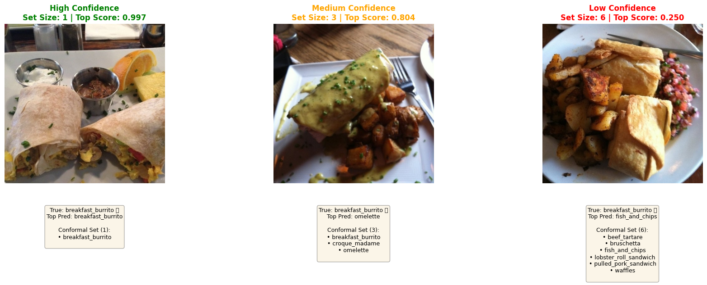

# Food101 Conformal Prediction on Databricks

A production-ready implementation of conformal prediction for food image classification using the Food101 dataset on Databricks.



*Three examples from the Food101 dataset with 90% prediction sets generated by RAPS conformal prediction, illustrating how set size adapts based on image difficulty. **Left:** High confidence - clear image yields a small prediction set (1-2 classes). **Center:** Medium confidence - ambiguous features result in a moderate prediction set (3-5 classes). **Right:** Low confidence - difficult/unclear image produces a larger prediction set (6+ classes) to maintain coverage guarantee.*

## Overview

This project demonstrates rigorous uncertainty quantification for image classification using conformal prediction (RAPS - Regularized Adaptive Prediction Sets). Instead of just predicting a single class, conformal prediction provides **prediction sets** with statistical guarantees (e.g., 90% coverage).

## Notebooks

### 01-Data-Ingestion.ipynb
**Purpose:** Load and prepare the Food101 dataset for model training

**What it does:**
- Loads Food101 images from HDF5 files stored in Databricks volumes
  - Training set: 10,099 images (64×64 pixels)
  - Validation set: 1,000 images (64×64 pixels)
- Converts images from h5 format to JPEG binary
- Writes data to a bronze Delta table with schema:
  - `split`: string (train/validation)
  - `label_id`: integer (0-100)
  - `label`: string (food category name)
  - `image_bytes`: binary (JPEG format)

**Output:** `jdub_demo_aws.food101.bronze_low_res` Delta table

**Key Features:**
- Handles one-hot encoded labels from h5 files
- Efficient batch loading (no streaming needed for static dataset)
- Image preview using base64 encoding and displayHTML
- 101 food categories from the Food101 dataset

---

### 02-Conformal-Classification.ipynb
**Purpose:** Apply conformal prediction to food image classification

**What it does:**
- Loads pre-trained Vision Transformer model for food classification
- Implements RAPS (Regularized Adaptive Prediction Sets) algorithm
- Generates prediction sets with statistical coverage guarantees
- Provides uncertainty quantification for each prediction

**Key Concepts:**
- **Calibration Set:** Used to compute conformal thresholds
- **Test Set:** Evaluates coverage and prediction set sizes
- **Coverage Guarantee:** Ensures prediction sets contain true label with ≥90% probability
- **Adaptive Sets:** Smaller prediction sets for confident predictions, larger for uncertain ones

**Output:**
- Prediction sets for each test image
- Coverage metrics
- Set size distribution
- Uncertainty-aware classifications

---

## Dataset Schema

```
root
 |-- split: string (train/validation)
 |-- label_id: integer (0-100)
 |-- label: string (food category)
 |-- image_bytes: binary (JPEG format)
```

**Food Categories:** 101 classes including apple_pie, sushi, pizza, hamburger, ice_cream, and more.

---

## Quick Start

### Prerequisites
- Databricks workspace with Unity Catalog enabled
- Databricks Runtime 13.0+ (includes Spark 3.4+)
- Access to volumes: `/Volumes/jdub_demo_aws/food101/food101_data/`

### Running the Notebooks

1. **Data Ingestion** (Run once)
   ```bash
   # Import 01-Data-Ingestion.ipynb to Databricks
   # Attach to cluster and run all cells
   # Output: bronze_low_res Delta table
   ```

2. **Conformal Prediction**
   ```bash
   # Import 02-Conformal-Classification.ipynb to Databricks
   # Attach to cluster and run all cells
   # Output: Conformal prediction results with coverage guarantees
   ```

---

## Technical Details

### Data Ingestion Pipeline
- **Input:** HDF5 files with images, one-hot encoded categories, category names
- **Processing:** Convert images to JPEG, decode labels, create PySpark Rows
- **Output:** Delta table optimized for distributed access
- **Performance:** ~11K images loaded in single batch operation

### Conformal Prediction
- **Algorithm:** RAPS (Regularized Adaptive Prediction Sets)
- **Coverage Target:** 90% (configurable)
- **Model:** Pre-trained Vision Transformer
- **Calibration:** Uses subset of data to compute conformal thresholds
- **Guarantee:** Prediction sets contain true label with ≥90% probability across test set

---

## Project Structure

```
food101_conformal_prod/
├── 01-Data-Ingestion.ipynb          # Data loading and preparation
├── 02-Conformal-Classification.ipynb # Conformal prediction implementation
├── images/                            # Visualization outputs
│   └── food101_high_med_low_BB.png
└── README.md                          # This file
```

---

## Key Benefits

✅ **Statistical Guarantees:** Prediction sets have provable coverage properties  
✅ **Uncertainty Quantification:** Know when the model is confident vs uncertain  
✅ **Production Ready:** Built on Databricks Delta Lake for reliability  
✅ **Scalable:** Uses Spark for distributed data processing  
✅ **Flexible:** Easy to adjust coverage levels and apply to new models  

---

## References & Inspiration

This implementation is inspired by the excellent work from:

**A Gentle Introduction to Conformal Prediction and Distribution-Free Uncertainty Quantification**  
Anastasios N. Angelopoulos and Stephen Bates  
Paper: [arXiv:2107.07511](https://arxiv.org/abs/2107.07511)  
Code: [github.com/aangelopoulos/conformal-prediction](https://github.com/aangelopoulos/conformal-prediction)

Their repository provides lightweight, practical implementations of conformal prediction on real-world datasets including ImageNet, MS-COCO, and more.

---

## License

This project builds upon open-source conformal prediction methods and the Food101 dataset.

**Food101 Dataset:**  
Bossard, Lukas and Guillaumin, Matthieu and Van Gool, Luc  
*Food-101 -- Mining Discriminative Components with Random Forests*  
European Conference on Computer Vision, 2014

---

## Author

Jonathan Whiteley  
Built on Databricks Platform

